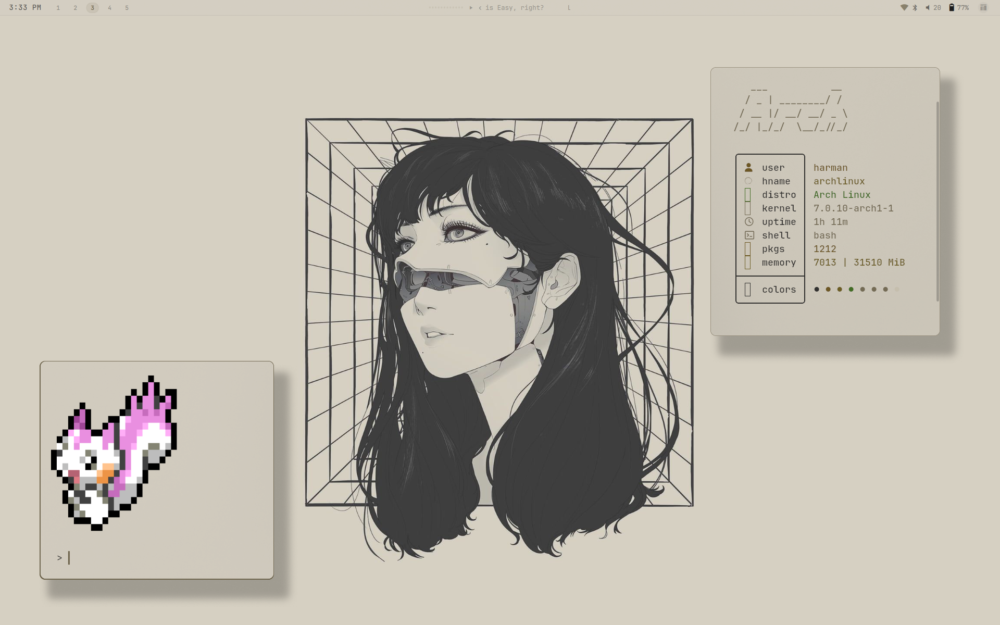
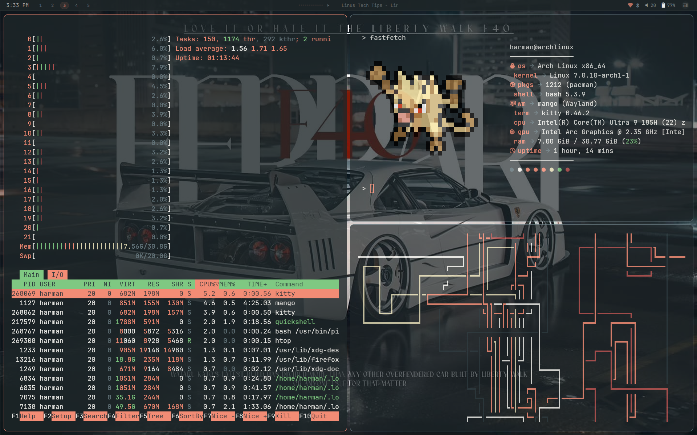
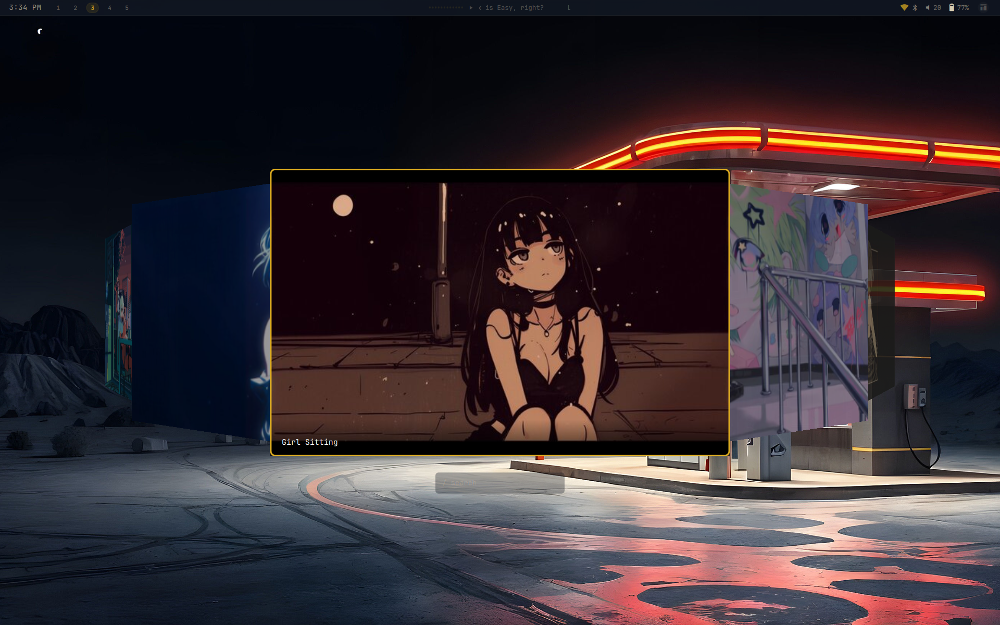
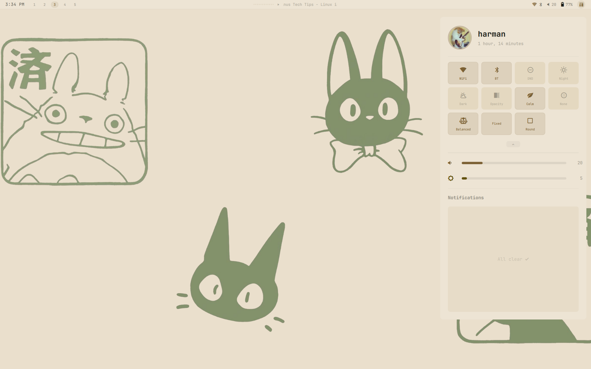
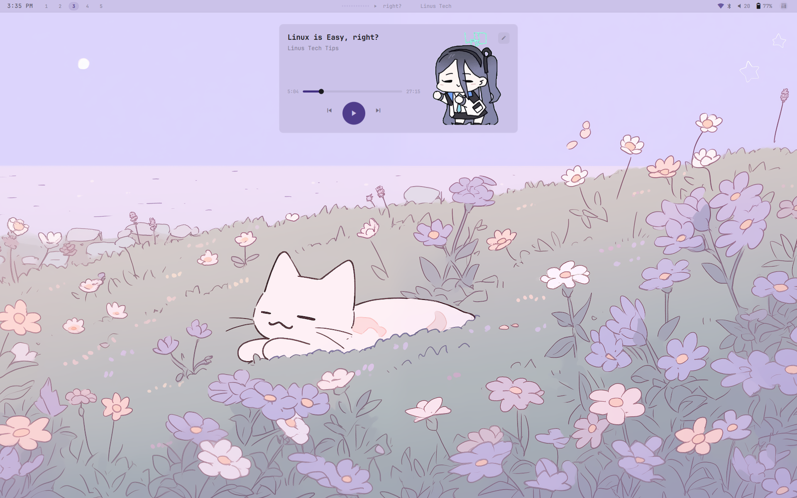
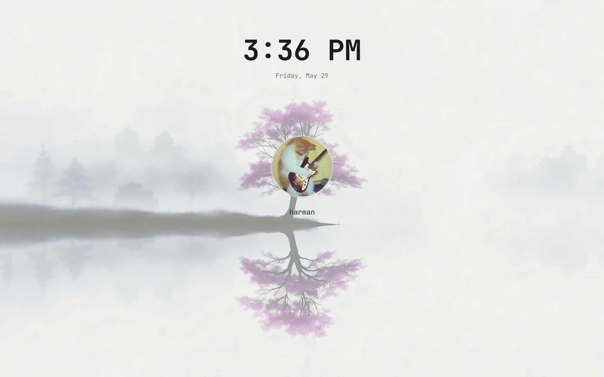

# Harman's Mango Config


| Component | Tool |
|-----------|------|
| **WM** | MangoWM-ext (fork of MangoWM which is also a fork of DWM) |
| **Terminal** | Kitty |
| **Widgets** | QuickShell |
| **App Launcher** | Quickshell |
| **Lockscreen** | Quickshell |
| **Notifications** | Tiramisu + Quickshell |
| **Wallpapers** | awww + mpvpaper |
| **Bar** | Quickshell |

## Screenshots








## Installation

```bash
git clone https://github.com/Harman1307/MangoWM-Dotfiles.git
cd MangoWM-Dotfiles
chmod +x install.sh
./install.sh
```
> Note: This will backup your existing config before installing 

### THANKS FOR READING :)
