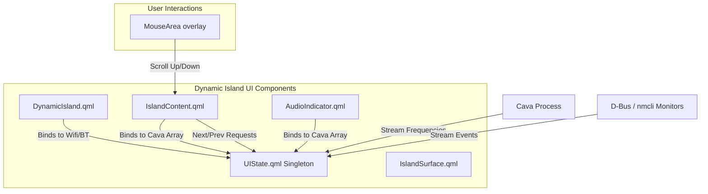

# Architectural Specification & Refinement Plan: Dynamic Island Enhancements

**Project:** Kamalen Shell (MangoWM Rice/Dotfiles)  
**Goal:** Refine the new Dynamic Island's audio visualizer, text scrolling layout, and mouse wheel navigation, and optimize system indicators to reduce CPU usage.

---

## 1. Current State Analysis

1. **Audio Visualizer Simulation**:
   - `AudioIndicator.qml` simulates an audio waveform using a `SequentialAnimation` with two nested `NumberAnimation` blocks looping infinitely on height. This approach consumes CPU cycles continuously while active without reflecting real-world audio output.
   - Similar simulation loops are used in `IslandContent.qml` under `collapsedBumpMedia` (lines 227-243) and `mediaArtwork` (lines 654-670) when no cover art is available.
   - Real-time frequency data is already captured by a `cava` process in `UIState.qml` and exposed via the `UIState.cava` array, which is successfully used by `Bar.qml`.

2. **Text Clipping & Elision**:
   - `IslandContent.qml` currently displays track title and artist name with `elide: Text.ElideRight` in a fixed-width bounds container. Long names are abruptly clipped, which degrades the UX compared to the scrolling marquee used in the legacy `Bar.qml`.

3. **Media Controls**:
   - The media controls are click-only. There is no scroll support to change tracks, which is standard in other parts of the desktop shell (e.g. `Bar.qml`).

4. **Inefficient System Indicators Polling**:
   - `DynamicIsland.qml` runs a polling timer every 3 seconds to spawn heavy commands (`nmcli`, `bluetoothctl`) via separate `Process` blocks. This triggers micro-freezes and wastes resources. `Bar.qml` already implements event-driven observers (`nmcli monitor` and D-Bus monitor) that can be centralized.

---

## 2. Proposed Architecture & Design



---

## 3. Technical Implementation Design

### 3.1 CAVA Visualizer Integration (`AudioIndicator.qml`)
- Remove the nested loop simulation timers and bind the visualizer heights to `UIState.cava` array using specific indices.
- Smooth out transitions using a `Behavior on height`.

**Code Diff proposal for `.config/quickshell/AudioIndicator.qml`**:
```diff
--- .config/quickshell/AudioIndicator.qml
+++ .config/quickshell/AudioIndicator.qml
@@ -14,6 +14,8 @@
     readonly property bool showing: active && !dismissed
     readonly property bool animating: showing && playing
+    readonly property var cavaIndices: [1, 5, 9] // Bass, mid, treble mapping
 
     function a(c, o) { return Qt.rgba(c.r, c.g, c.b, o) }
 
@@ -41,29 +43,13 @@
             Repeater {
                 model: 3
 
                 Rectangle {
                     id: bar
 
                     width: 2
-                    height: root.animating ? (4 + index * 2) : 3
+                    height: root.animating ? Math.max(3, 3 + UIState.cava[root.cavaIndices[index]] * 7) : 3
                     radius: 1
                     color: root.barColor
                     anchors.verticalCenter: parent.verticalCenter
 
-                    SequentialAnimation on height {
-                        running: root.animating
-                        loops: Animation.Infinite
-
-                        NumberAnimation {
-                            to: 3 + (index % 3) * 2
-                            duration: 240 + index * 60
-                            easing.type: Easing.InOutSine
-                        }
-
-                        NumberAnimation {
-                            to: 8 - (index % 2) * 3
-                            duration: 280 + index * 50
-                            easing.type: Easing.InOutSine
-                        }
-                    }
+                    Behavior on height {
+                        NumberAnimation { duration: 50; easing.type: Easing.OutQuad }
+                    }
                 }
             }
         }
```

### 3.2 Scrolling Text Marquee (`IslandContent.qml`)
- Replace the static `Text` component for the media title and artist with a clipping `Item` containing a horizontal scroll track (`Row` containing two duplicate texts).
- Run a linear `NumberAnimation` on the track's `x` offset.

**Code Diff proposal for `.config/quickshell/IslandContent.qml`**:
```diff
--- .config/quickshell/IslandContent.qml
+++ .config/quickshell/IslandContent.qml
@@ -691,15 +691,59 @@
             RowLayout {
                 Layout.fillWidth: true
                 spacing: 8
 
-                Text {
+                Item {
+                    id: titleMarqueeRoot
                     Layout.fillWidth: true
-                    text: root.title
-                    color: root.primaryText
-                    elide: Text.ElideRight
-                    font.family: root.fontFamily
-                    font.pixelSize: 13
-                    font.bold: true
+                    Layout.preferredHeight: 18
+                    clip: true
+
+                    readonly property real maxWidth: titleMarqueeRoot.width
+                    readonly property real gap: 30
+                    readonly property real unitWidth: titleTextA.implicitWidth + gap
+                    readonly property bool scrolling: titleTextA.implicitWidth > maxWidth
+
+                    Row {
+                        id: titleMarqueeTrack
+                        anchors.verticalCenter: parent.verticalCenter
+                        spacing: 0
+
+                        Text {
+                            id: titleTextA
+                            text: root.title
+                            color: root.primaryText
+                            font.family: root.fontFamily
+                            font.pixelSize: 13
+                            font.bold: true
+                        }
+
+                        Item {
+                            width: titleMarqueeRoot.gap
+                            height: 1
+                            visible: titleMarqueeRoot.scrolling
+                        }
+
+                        Text {
+                            id: titleTextB
+                            text: root.title
+                            color: root.primaryText
+                            font.family: root.fontFamily
+                            font.pixelSize: 13
+                            font.bold: true
+                            visible: titleMarqueeRoot.scrolling
+                        }
+                    }
+
+                    NumberAnimation {
+                        id: titleMarqueeAnim
+                        target: titleMarqueeTrack
+                        property: "x"
+                        from: 0
+                        to: -titleMarqueeRoot.unitWidth
+                        duration: titleMarqueeRoot.unitWidth * 25
+                        loops: Animation.Infinite
+                        running: titleMarqueeRoot.scrolling && root.playing
+                        easing.type: Easing.Linear
+                    }
+
+                    onWidthChanged: {
+                        titleMarqueeAnim.stop()
+                        titleMarqueeTrack.x = 0
+                        if (titleMarqueeRoot.scrolling && root.playing) titleMarqueeAnim.start()
+                    }
+
+                    Connections {
+                        target: root
+                        function onTitleChanged() {
+                            titleMarqueeAnim.stop()
+                            titleMarqueeTrack.x = 0
+                            if (titleMarqueeRoot.scrolling && root.playing) titleMarqueeAnim.start()
+                        }
+                        function onPlayingChanged() {
+                            if (!root.playing) {
+                                titleMarqueeAnim.stop()
+                                titleMarqueeTrack.x = 0
+                            } else if (titleMarqueeRoot.scrolling) {
+                                titleMarqueeAnim.start()
+                            }
+                        }
+                    }
                 }
 
                 Text {
```

*(A similar structure can optionally be applied to the artist block using an `artistMarqueeRoot` item of height 14.)*

### 3.3 Mouse Wheel Scroll Support (`IslandContent.qml`)
- Overlay a transparent `MouseArea` on the media layout that ignores clicks (`acceptedButtons: Qt.NoButton`) but captures wheel events.

**Code Diff proposal for `.config/quickshell/IslandContent.qml`**:
```diff
--- .config/quickshell/IslandContent.qml
+++ .config/quickshell/IslandContent.qml
@@ -982,5 +982,16 @@
         Behavior on opacity {
             NumberAnimation {
                 duration: Animations.fast
             }
         }
     }
+
+    MouseArea {
+        id: mediaWheelArea
+        anchors.fill: mediaContent
+        acceptedButtons: Qt.NoButton // Allow clicks to fall through to child buttons
+        visible: mediaContent.visible && mediaContent.opacity > 0
+        onWheel: (wheel) => {
+            if (wheel.angleDelta.y > 0) {
+                root.nextRequested();
+            } else {
+                root.previousRequested();
+            }
+        }
+    }
 }
```

---

## 4. Performance & Styling Recommendations

### 4.1 Centralize Wifi & Bluetooth Monitoring
- Spawning process commands every 3 seconds (`nmcli`, `bluetoothctl`) inside `DynamicIsland.qml` is resource-heavy.
- **Recommendation**: Move network and bluetooth monitoring to `UIState.qml` using event-driven `Process` observers (like `nmcli monitor` and `dbus-monitor` in `Bar.qml`).
- Both `Bar.qml` and `DynamicIsland.qml` will bind to unified state properties (e.g. `UIState.wifiSsid`, `UIState.wifiSignal`, `UIState.btDeviceName`, etc.) to eliminate double process overhead and reduce CPU usage to near 0%.

### 4.2 Replace Other Simulated Visualizers
- Replace the inline simulation repeaters in `IslandContent.qml`'s `collapsedCover` (lines 227-243) and `mediaArtwork` (lines 654-670) with direct CAVA bindings matching `AudioIndicator.qml`.

---

## 5. Architectural Decision Records (ADRs)

### ADR-003: Unified Singleton System Observers
- **Context**: Duplicated timers and CLI polling calls between `Bar.qml` and `DynamicIsland.qml` consume unnecessary resources.
- **Decision**: Centralize system state watchers in `UIState.qml` using event-driven/reactive subprocesses.
- **Consequences**:
  - *Positive*: Zero polling overhead, single point of truth, unified codebase, improved frame rates.
  - *Negative*: A single crash in the D-Bus monitor could affect both the Bar and the Dynamic Island (mitigated by restart timers).

---

## 6. Implementation Checklist

- [ ] Connect `AudioIndicator.qml` to `UIState.cava` and remove simulated animations.
- [ ] Add the tray indicator and `AudioIndicator` initialization to the right side of `DynamicIsland.qml`'s idle view.
- [ ] Implement scrolling marquee in `IslandContent.qml` for the track title and artist name.
- [ ] Add `mediaWheelArea` to handle mouse wheel track changing in `IslandContent.qml`.
- [ ] Refactor system observers out of `DynamicIsland.qml` and into `UIState.qml`.
- [ ] Standardize the remaining simulated visualizer repeaters in `IslandContent.qml`.
