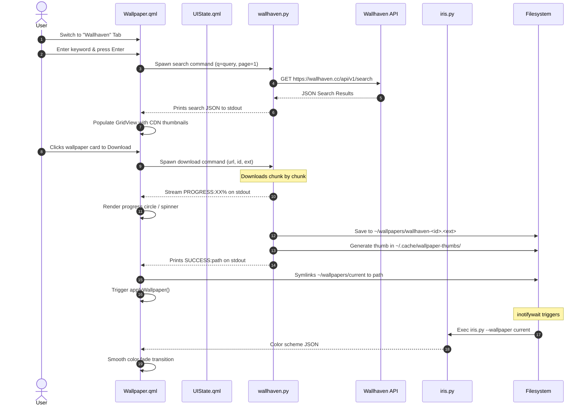

# Architectural Specification: Wallhaven Wallpaper Search & Downloader

**Project:** Kamalen Shell (MangoWM Rice/Dotfiles)  
**Feature:** Dynamic Wallhaven Downloader  
**Goal:** Enable users to search, preview, asynchronously download, and automatically apply wallpapers from Wallhaven directly within the Kamalen Shell overlay.

---

## 1. Current State Analysis

### Wallpaper Management Flow
The wallpaper system in Kamalen Shell currently manages wallpapers using a localized, event-driven pattern:
1. **Scanning**: At startup, `shell.qml` runs `wallPregenProc` which scans `~/wallpapers` for image (`.jpg`, `.png`, etc.) and video (`.mp4`, `.webm`, etc.) files. It generates 600px width thumbnails in `~/.cache/wallpaper-thumbs/` and updates a cached JSON registry at `~/.cache/wallpaper-thumbs/walls.json`.
2. **UI Carousel**: `Wallpaper.qml` is a full-screen overlay panel showing a 3D carousel (`sceneRoot` repeater) of these local wallpapers. It reads the local registry and supports search/filter by matching filename text.
3. **Application**: When a wallpaper is selected:
   - For images: It symlinks `~/wallpapers/current` to the selected file, runs `awww img` (the backend wallpaper transition utility) with a custom wipe transition.
   - For videos: It pkill-s `mpvpaper`, links the file, extracts a first-frame placeholder via `ffmpeg`, applies it using `awww`, and then runs `mpvpaper --fork` to loop the video background.
4. **Color Extraction**:
   - `Colors.qml` runs an `inotifywait` watcher (`wallWatch`) on `~/wallpapers`. When the symlink `~/wallpapers/current` changes, it restarts `irisProc`, invoking `python3 ~/.config/quickshell/iris/iris.py --wallpaper ~/wallpapers/current`.
   - `iris.py` uses PIL and NumPy to execute a K-Means clustering algorithm, extracts a 14-color palette, generates semantic/accent/syntax colors, and writes them to Neovim (`colors.lua`), GTK CSS, Starship, and Kitty color files. It prints the color scheme JSON on stdout.
   - `Colors.qml` parses this stdout JSON and dynamically updates the colors singleton, triggering smooth QML UI color transitions.

---

## 2. System Requirements

### 2.1 Functional Requirements
- **FR-001: Wallhaven Search API v1 Integration**: Query Wallhaven by keywords, category checkboxes (General, Anime, People), purity filters (restricted to SFW for shell safety), and resolutions.
- **FR-002: Dynamic Grid Interface**: Introduce an "Online Search" view toggle in the wallpaper panel showing a scrollable grid of search result thumbnails loaded from Wallhaven CDN.
- **FR-003: Asynchronous Download**: Execute wallpaper downloads in the background without blocking the main QML rendering thread, providing real-time progress percentages.
- **FR-004: Automatic Post-Download Processing**: Upon download completion:
  1. Save the wallpaper to `~/wallpapers/wallhaven-<id>.<ext>`.
  2. Generate a local 600px thumbnail in `~/.cache/wallpaper-thumbs/` immediately.
  3. Relink `~/wallpapers/current` to the downloaded file.
  4. Trigger wallpaper application and `iris.py` theme regeneration.
- **FR-005: Query Pagination**: Support browsing multiple pages of search results via a "Load More" action or infinite scrolling.

### 2.2 Non-Functional Requirements
- **NFR-001: Non-blocking UI**: QML should never freeze during network searches, downloads, or thumbnail processing. All heavy tasks must run in helper subprocesses.
- **NFR-002: Zero-Dependency Python Helper**: Avoid external library dependencies (like `requests`) for Wallhaven API interaction and file downloads to maintain system portability.
- **NFR-003: UI/UX Continuity**: Reuse existing font styling, border radii, and animation presets to keep the experience native.

---

## 3. Proposed Architecture & Design

We propose a decoupled architecture separating the **QML presentation layer** from a **Python backend helper**.



### Component Structure
```
kamalen-shell/
├── .config/
│   ├── quickshell/
│   │   ├── wallhaven/
│   │   │   └── wallhaven.py      # New: API query & download helper
│   │   ├── Wallpaper.qml         # Modified: Adds Online tab, Grid, API hooks
│   │   ├── UIState.qml           # Modified: Adds Wallhaven user settings
│   │   └── ...
```

---

## 4. Component Technical Design

### 4.1 Backend: `.config/quickshell/wallhaven/wallhaven.py`
A CLI tool written in pure Python. It uses `urllib.request` for network calls and `PIL` (Pillow) for thumbnail generation since PIL is already present in the environment for `iris.py`.

#### CLI Commands
- `python3 wallhaven.py search --query "<q>" --categories "<cat>" --sorting "<sort>" --page <n> [--apikey <key>]`
- `python3 wallhaven.py download --url "<path>" --id "<id>" --ext "<ext>" --out-dir "<dir>"`

#### Source Code Design Structure
```python
import sys
import json
import os
import argparse
import urllib.request
import urllib.parse
from PIL import Image

def get_headers(apikey=None):
    headers = {"User-Agent": "KamalenShellWallhavenDownloader/1.0"}
    if apikey:
        headers["X-API-Key"] = apikey
    return headers

def search(args):
    params = {
        "q": args.query,
        "categories": args.categories or "111", # General/Anime/People
        "purity": "100", # Restrict to SFW
        "sorting": args.sorting or "relevance",
        "order": "desc",
        "page": str(args.page or 1)
    }
    url = f"https://wallhaven.cc/api/v1/search?{urllib.parse.urlencode(params)}"
    req = urllib.request.Request(url, headers=get_headers(args.apikey))
    try:
        with urllib.request.urlopen(req) as resp:
            data = json.loads(resp.read().decode("utf-8"))
            # Standardize outputs
            results = []
            for item in data.get("data", []):
                results.append({
                    "id": item.get("id"),
                    "url": item.get("url"),
                    "path": item.get("path"),
                    "thumbnail": item.get("thumbs", {}).get("large"),
                    "resolution": item.get("resolution"),
                    "file_type": item.get("file_type"),
                    "file_size": item.get("file_size"),
                })
            print(json.dumps(results))
    except Exception as e:
        print(json.dumps({"error": str(e)}), file=sys.stderr)
        sys.exit(1)

def download(args):
    os.makedirs(args.out_dir, exist_ok=True)
    filename = f"wallhaven-{args.id}{args.ext}"
    dest_path = os.path.join(args.out_dir, filename)
    
    req = urllib.request.Request(args.url, headers=get_headers())
    try:
        with urllib.request.urlopen(req) as resp:
            total_size = int(resp.info().get('Content-Length', 0))
            downloaded = 0
            block_size = 1024 * 64
            
            with open(dest_path, "wb") as f:
                while True:
                    buffer = resp.read(block_size)
                    if not buffer:
                        break
                    f.write(buffer)
                    downloaded += len(buffer)
                    if total_size:
                        percent = int((downloaded / total_size) * 100)
                        # Print progress updates for QML SplitParser
                        print(f"PROGRESS:{percent}")
                        sys.stdout.flush()
                        
            # Generate thumbnail immediately
            thumb_dir = os.path.expanduser("~/.cache/wallpaper-thumbs")
            os.makedirs(thumb_dir, exist_ok=True)
            thumb_path = os.path.join(thumb_dir, f"{filename}.thumb.jpg")
            try:
                img = Image.open(dest_path)
                img.thumbnail((600, 600))
                img.convert("RGB").save(thumb_path, "JPEG", quality=85)
            except Exception as thumb_err:
                print(f"WARN: Failed to create thumbnail: {thumb_err}", file=sys.stderr)
                
            print(f"SUCCESS:{dest_path}")
    except Exception as e:
        print(f"ERROR:{str(e)}")
        sys.exit(1)
```

### 4.2 Frontend: `.config/quickshell/Wallpaper.qml`
`Wallpaper.qml` is updated to implement a tabbed or toggleable layout, transitioning between Local (carousel) and Online (grid).

#### UI Elements Structure
- **Tab Header**: Adds tabs "Local" and "Wallhaven" at the top of the interface.
- **Search Bar**:
  - In Local Tab: continues filtering local `walls` list.
  - In Wallhaven Tab: triggers the `wallhavenSearchProc` process on Enter.
- **Wallhaven GridView**:
  - Activated when `currentTab === "online"`.
  - Displays a grid of results from a QML `ListModel`.
  - Item cards display the Wallhaven thumbnail directly from Wallhaven's CDN.
  - Hovering a card overlays metadata: resolution and file size.
  - Displays a progress ring or spinner overlay when an item's download state is active.
- **Backend Communication Hooks**:
  ```qml
  // Model for GridView
  ListModel {
      id: onlineModel
  }

  property bool loadingSearch: false
  property string activeDownloadId: ""
  property int downloadPercent: 0

  Process {
      id: searchProc
      // dynamic arguments: ["python3", wallhavenScript, "search", "--query", queryText, ...]
      stdout: SplitParser {
          splitMarker: "\n"
          onRead: data => {
              try {
                  var list = JSON.parse(data.trim());
                  onlineModel.clear();
                  for (var i = 0; i < list.length; i++) {
                      list[i].downloading = false;
                      list[i].progress = 0;
                      onlineModel.append(list[i]);
                  }
              } catch(e) {
                  console.log("Wallhaven Search JSON Parse Error: ", e);
              }
          }
      }
      onExited: loadingSearch = false
  }

  Process {
      id: downloadProc
      // dynamic arguments: ["python3", wallhavenScript, "download", "--url", url, "--id", id, "--ext", ext, "--out-dir", wallDir]
      stdout: SplitParser {
          splitMarker: "\n"
          onRead: data => {
              var line = data.trim();
              if (line.startsWith("PROGRESS:")) {
                  downloadPercent = parseInt(line.substring(9)) || 0;
              } else if (line.startsWith("SUCCESS:")) {
                  var fullPath = line.substring(8);
                  downloadPercent = 100;
                  activeDownloadId = "";
                  
                  // Reload local wallpaper list so the new wall is available
                  currentWallProc.running = true;
                  
                  // Link and apply downloaded wallpaper
                  var filename = fullPath.substring(fullPath.lastIndexOf('/') + 1);
                  var isVideo = filename.endsWith(".mp4") || filename.endsWith(".webm");
                  applyWallpaper({ name: filename, isVideo: isVideo });
              } else if (line.startsWith("ERROR:")) {
                  activeDownloadId = "";
                  console.log("Download failed: " + line.substring(6));
              }
          }
      }
  }
  ```

---

## 5. Architectural Decision Records (ADRs)

### ADR-002: Use Zero-Dependency Python CLI Helper for API Integration
#### Context
Quickshell does not provide a robust, asynchronous HTTP/File API natively inside QML for handling multi-megabyte image downloads, and QML's `XMLHttpRequest` can cause blocking issues on the main rendering thread for large file operations.
#### Decision
Use a zero-dependency Python script helper (`wallhaven.py`) spawned via Quickshell's `Process` component.
#### Consequences
- **Positive**: Native asynchronous execution out-of-the-box (handled by Quickshell's internal loop). Direct file I/O and thumbnail generation inside Python. Zero dependencies beyond python standard library + PIL.
- **Negative**: Overhead of spawning a subprocess (trivial for network/download tasks).

### ADR-003: Locally Generate Thumbnail Post-Download
#### Context
Local wallpapers require thumbnails to render smoothly in the carousel overlay. If the new wallpaper is downloaded but has no local thumbnail, rendering it during selection transitions will be slow.
#### Decision
Have the download helper script (`wallhaven.py`) write a compressed 600px thumbnail immediately into `~/.cache/wallpaper-thumbs/` using PIL right after finishing the download chunk.
#### Consequences
- **Positive**: Direct database and carousel synchronization. No latency when opening the "Local" tab next time.
- **Negative**: Slightly increases the total duration of the download command (by ~50-100ms).

---

## 6. Implementation Checklist

- [ ] Create `.config/quickshell/wallhaven/` directory.
- [ ] Implement `wallhaven.py` Python helper (API search, download loop, PIL thumbnail hook).
- [ ] Add Wallhaven user settings properties (e.g. `wallhavenApiKey`) to `UIState.qml`.
- [ ] Modify `Wallpaper.qml` to:
  - Add tab states (`currentTab: "local"` / `"online"`).
  - Bind search field and keys depending on active tab.
  - Implement a `GridView` for Wallhaven thumbnails.
  - Hook search and download backend `Process` components.
  - Style cards with hover info and loading indicators.
- [ ] Validate wallpaper change triggers `iris.py` color extraction as expected.
